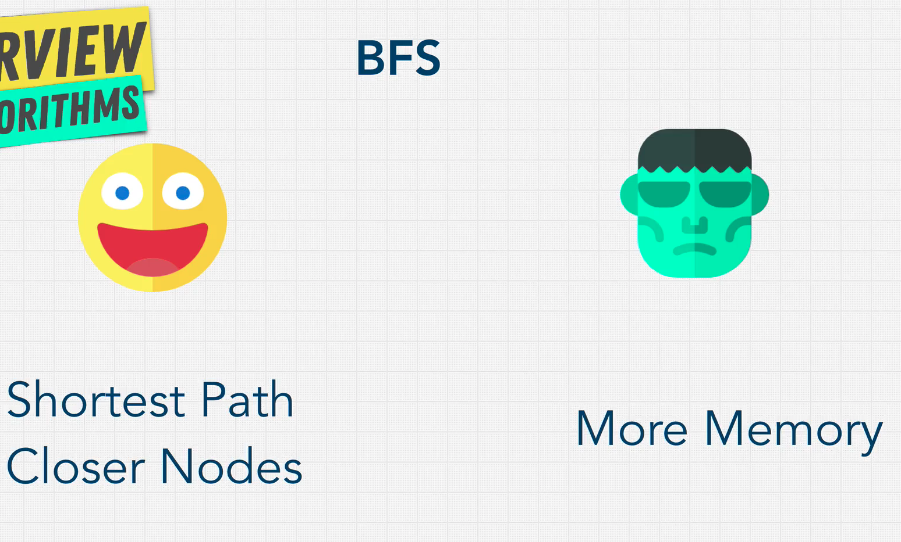
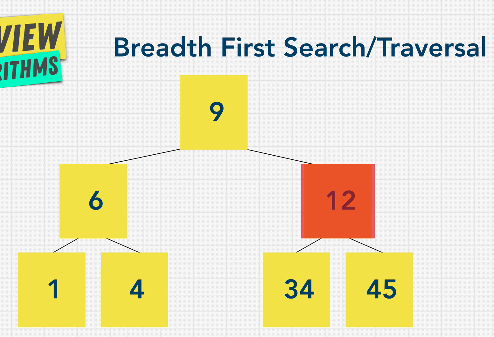
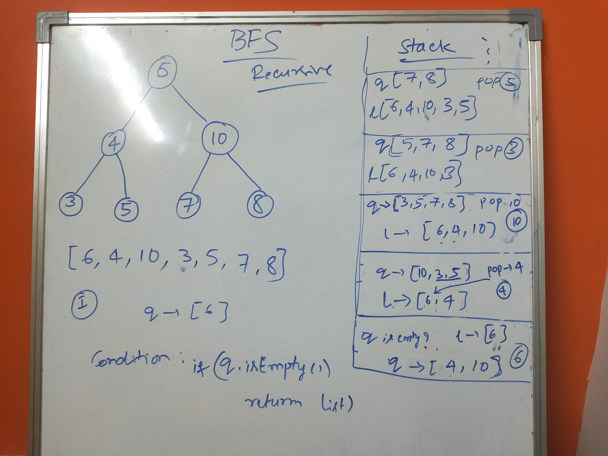
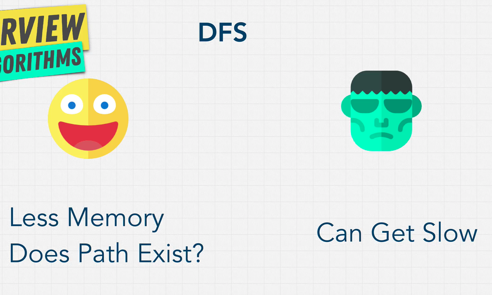
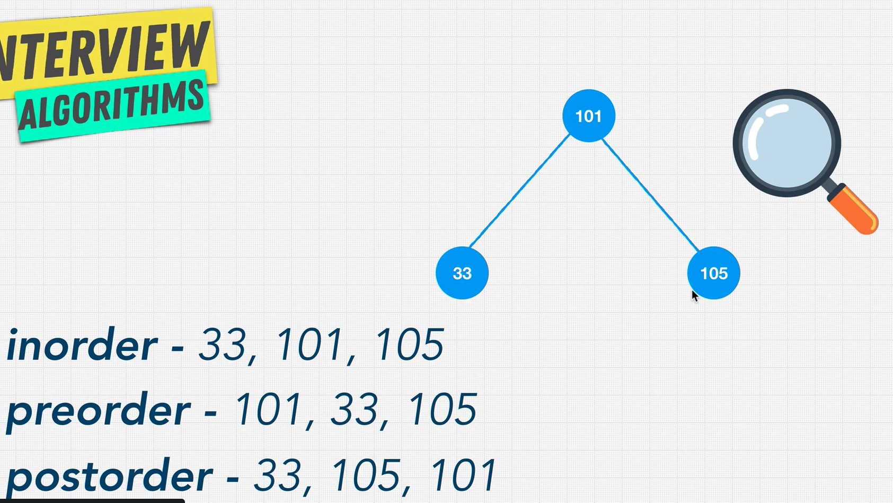
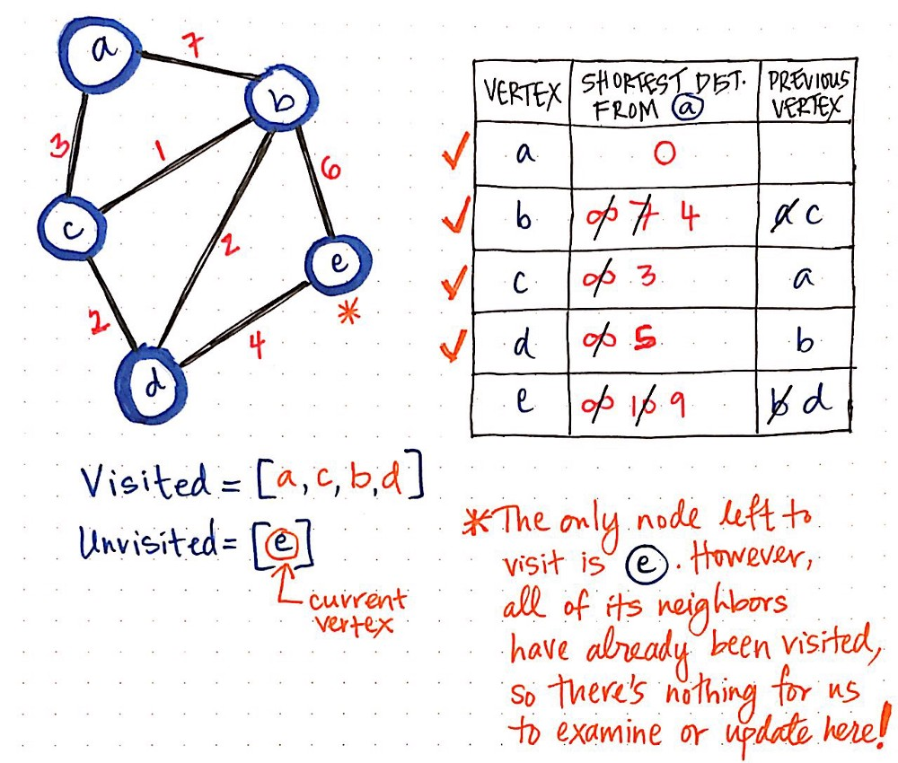

## Info and Docs

## Notes

##BFS

## DFS

## Exercise
####If you know a solution is not far from the root of the tree:
BFS

####If the tree is very deep and solutions are rare, 
BFS (DFS will take long time. )

####If the tree is very wide:
DFS (BFS will need too much memory)

####If solutions are frequent but located deep in the tree
DFS

####determining whether a path exists between two nodes
DFS

####Finding the shortest path
BFS

## BFS vs DFS
[What is the time and space complexity of a breadth first and depth first tree traversal?](https://stackoverflow.com/questions/9844193/what-is-the-time-and-space-complexity-of-a-breadth-first-and-depth-first-tree-tr)

## Shortest path using Dijkstra's algo: Weighted graphs

[Finding The Shortest Path, With A Little Help From Dijkstra](https://medium.com/basecs/finding-the-shortest-path-with-a-little-help-from-dijkstra-613149fbdc8e)

