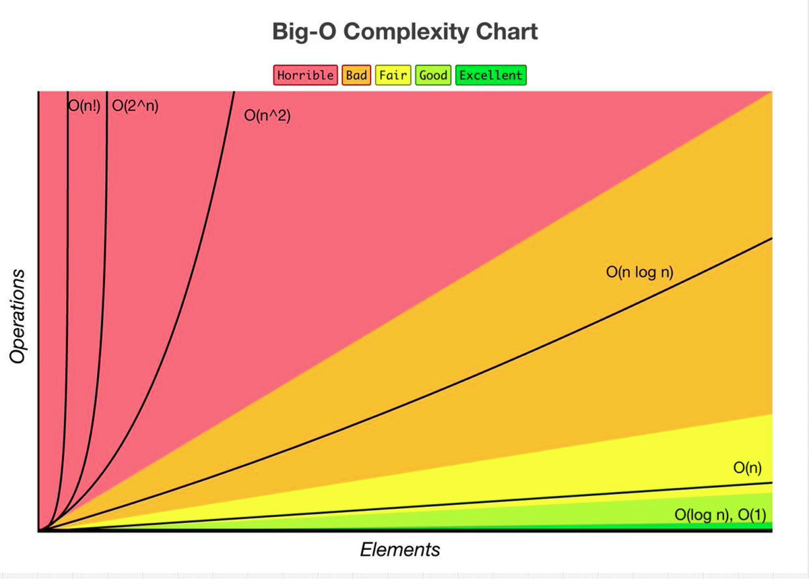
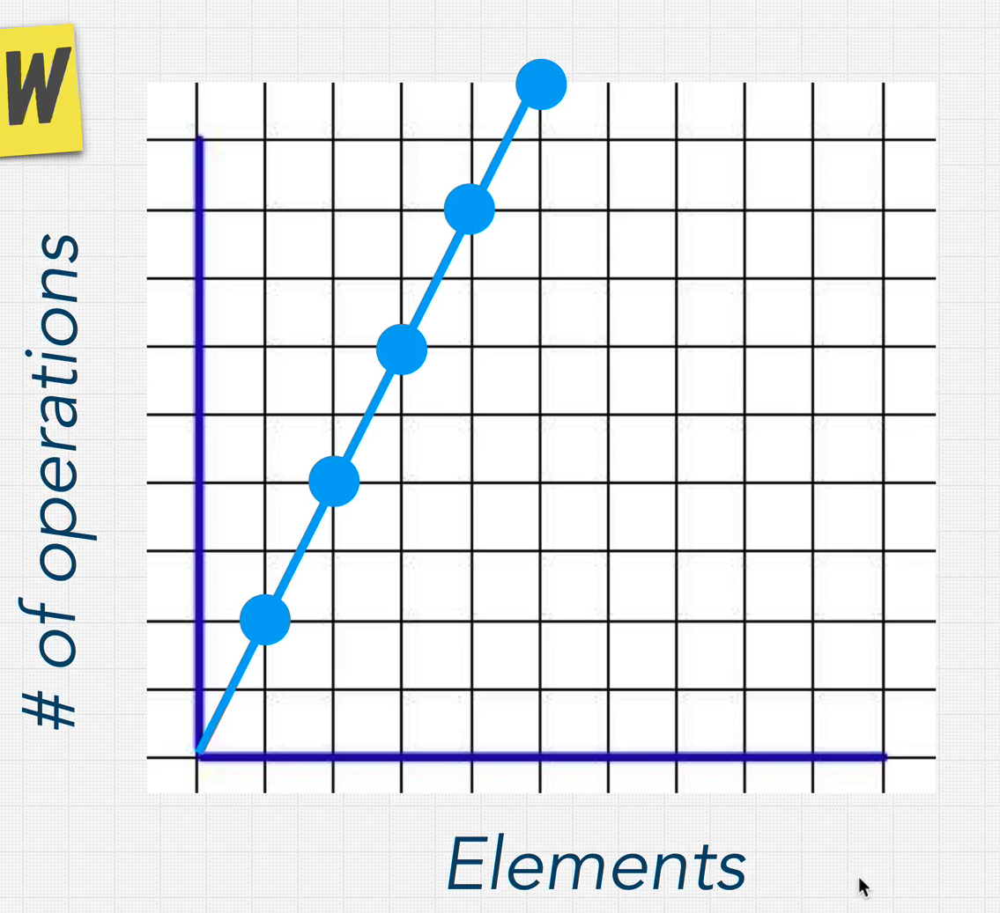
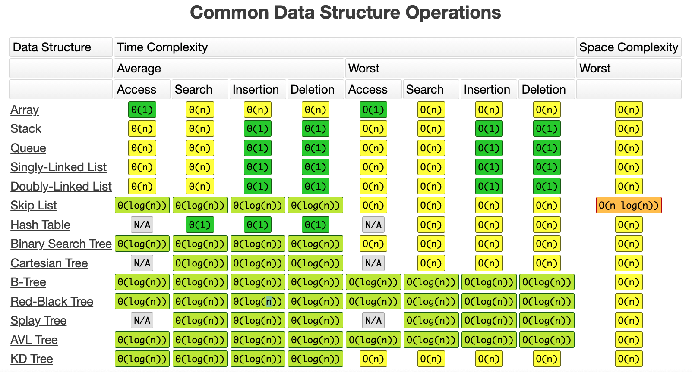
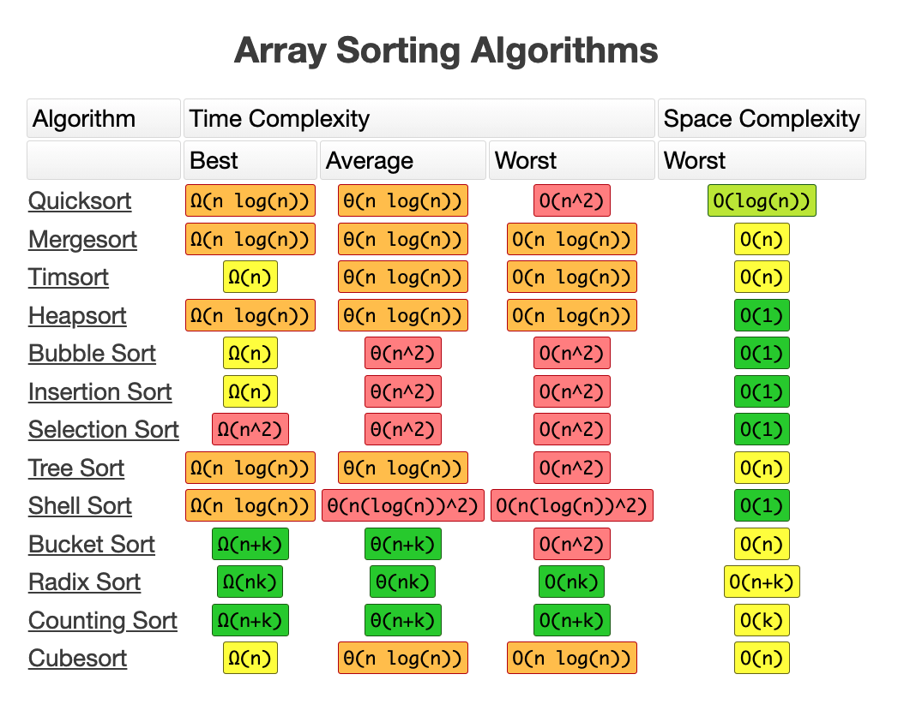

##Info and Docs

##Notes
The Big O notation specifically describes the worst-case scenario of an algorithm.

## Big Oh Complexity Chart


## BigO Of N - O(n) - Linear Time
-Input-Operations Chart.png)

[Example1 - BigOOfNExample](./src/main/java/com/kscm/BigOOfNExample.java)

## O(1) -> Constant Time
-Constant-Time-Input-Operations%20Chart.png)

[Example1 - Big O Of 1 Example](./src/main/java/com/kscm/BigOOf1Example.java)

#### BigOExercise1
[Example1 - BigOExercise1 ](./src/main/java/com/kscm/BigOExercise1.java)

#### What is the difference between big oh, big omega and big theta notations?
[Quora Link](https://www.quora.com/What-is-the-difference-between-big-oh-big-omega-and-big-theta-notations)

#### BigOExercise2
[Example1 - BigOExercise2 ](./src/main/java/com/kscm/BigOExercise2.java)

## Big Oh Rule Book


#### Rule1 - Worst case
Big Oh always cares about worst case scenario for an algorithm

[BigORule1Example](./src/main/java/com/kscm/BigORule1Example.java)

#### Rule2 - Remove or Drop the Constants
O(2n), 2 n loops in a algo --> Drop the constant --> So result is --> O(n)

Because, if you look at the graph below, graph is always linear irrespective of the constant, so its O(n) - Linear Time



#### Rule3 - Different terms for inputs
```js
function test(input1, input2) {
    for(int i=0; i<input1.length; i++) {
    
    }

    for(int i=0; i<input2.length; i++) {
    
    }

}
```
Here, Big Oh of the function test is: **O(m + n)** where m is size of input1 and n is the size of the input2

[BigORule3Example1](./src/main/java/com/kscm/BigORule3Example1.java)

[BigORule3Example2](./src/main/java/com/kscm/BigORule3Example2.java)

**O(n^2) -> Quadratic time**


**Please note: As per Big Oh Complexity Chart, n^2 complexity is horrible**

#### Rule 4: Drop Non Dominants
[BigORule4Example](./src/main/java/com/kscm/BigORule4Example.java)

BigO is for scalabality . Scalable means large inputs or worst case scenarios

####Important!
https://www.bigocheatsheet.com/





**Data Structures + Algorithms = Programs**

#### n! - Factorial- you are adding a loop for every element
[Example of O(n!)?](https://stackoverflow.com/questions/3953244/example-of-on)

