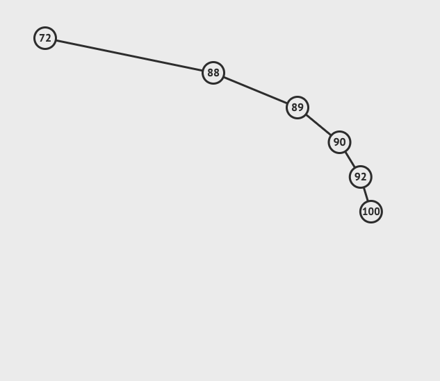
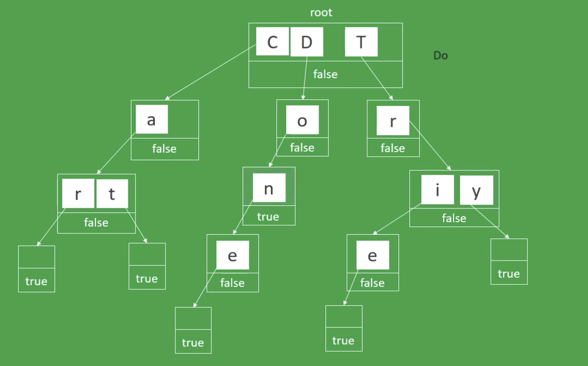

##Info & Docs
[AVL Tree Animations](https://www.cs.usfca.edu/~galles/visualization/AVLtree.html)

[AVL Tree - How it works?](https://medium.com/basecs/the-little-avl-tree-that-could-86a3cae410c7)

[Red-Black Trees Animation](https://www.cs.usfca.edu/~galles/visualization/RedBlack.html)

[Red-Black Trees - How it works?](https://medium.com/basecs/painting-nodes-black-with-red-black-trees-60eacb2be9a5)

[Red black tree over AVL tree](https://stackoverflow.com/questions/13852870/red-black-tree-over-avl-tree)

[Binary Heap - Visualgo](https://visualgo.net/en/heap?slide=1)

## What is a binary search tree?
- It will have one root node
- Each node contains zero or max 2 child nodes
- value lesser will be on left and higher or equal will be on right

## Example of imbalanced tree

## What are AVL Trees and Red block Trees?
These are the two trees which would solve imbalance in the binary tree.

If binary tree is not balanced well, then complexity becomes o(n) instead of O(logn)

## Why binary heap?
Root will have the max value and lesser values will be added under it. same logic appies for the rest of the nodes as well

Every child belongs to a parent which higher priority or higher value. This is also called Max Heap. Min Heap is exactly opposite

####  When will we use binary heap?
For comparision , binary heap will be helpful. Like all the values greater than 20.

[Binary Heap - Visualgo](https://visualgo.net/en/heap?slide=1)

#### Max Heap

## TRIE
[Trie Data Structure (EXPLAINED)](https://www.youtube.com/watch?v=-urNrIAQnNo)

